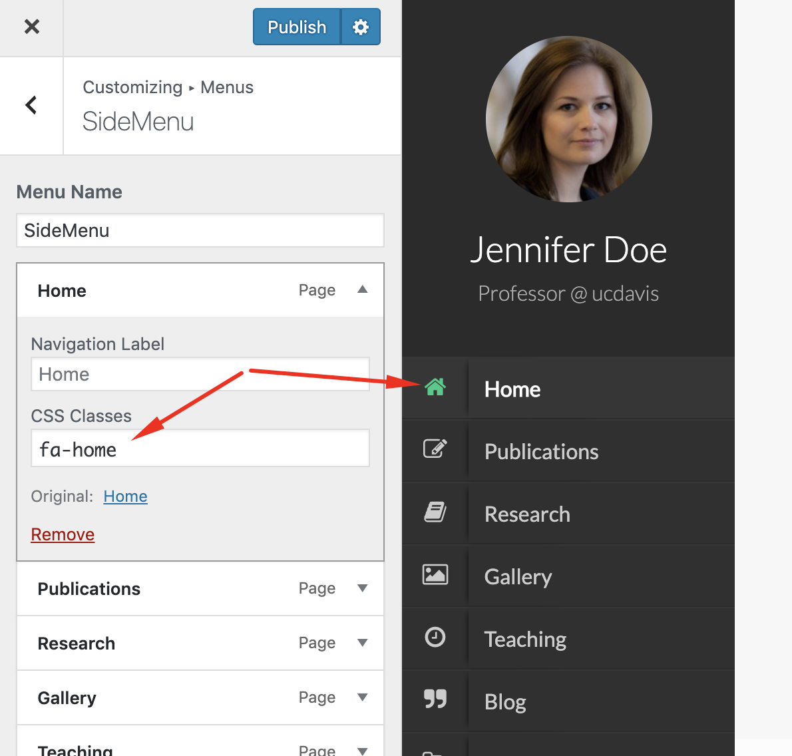

# FAQ

## Activate Visual Composer for Publications

As an administrator user, you should go to Visual Composer -&gt;**settings &gt; Role Management** and you can define which user groups can use the visual composer on which post types.

## Are you sure you want to do this? WordPress Error

!> This is not a theme issue or bug.

If you are installing Hilbert theme from the WordPress theme installer, but get a message that says _**Are you sure you want to do this?**_, most likely your web server is configured with a PHP settings that only allow a certain size ZIP file to be uploaded via WP admin.

Most hosting companies configure their servers to only have the maximum file upload size limit at 8-10 MB, some are less. If a file you want to upload is larger than that, then you will get that error!

**There are two ways to solve this problem.**

1. You can get your web host to increase your PHP limits so a larger zip file is allowed to be uploaded. They will know which limits to set if you explain the issue. Here are some recommended configurations:
  * `max_execution_time 60`
  * `memory_limit 128M`
  * `post_max_size 48M`
  * `upload_max_filesize 48M`
2. You can unzip theme zip file and upload the content directly to WordPress -&gt;wp-content-&gt;themes  theme via FTP and then go to dashboard-&gt;appearance-&gt;themes and activate Hilbert.

## Enable AJAX load for a page
After you have added your pages to the menu. You can set some or all of them to load using AJAX which makes the page transition enable for that menu item. You just need to add `ajax-fac` classname to that menu item.

Go to Admin > Appearance > Menus. Select the menu item and add `ajax-fac` CSS Classes to that item.

!> In case you don't see the CSS Classes field, from the top of the page click on **Screen Options** and check the **CSS Classes**

!> You don't need to add this class to your home page menu.  

## Page Templates

There are 4 types of templates provided by Faculty that you can make use of to build your pages.

#### Default Template
This is the main Template you can use for your simple pages, except pages which are built using Visual composer, Galley page and Publications page.

#### Gallery Template
Use this page template just for your Gallery. It is take a Title and Description from you and the rest of the page will be populated with the images you add to the Galley Custom Page type.

#### Page Builder Template
If you want to use the Visual Composer to build a page make sure to use this Template.

#### Page With Sidebar
This page template uses a built-in dynamic sidebar of the theme, and you can build the content of the page either using visual composer or the native WordPress editor. This page template added at v3.0 of the theme.

#### Publications
Use this page template just for your Publications page.

## How to add an image for publications page?
Go to <em>Admin > Appearance > Customizer > Publications</em> and there you can find the image field.

## How to upload my CV file?
Go to <em>Admin Panel > Media</em> and upload your file. Then you can click on it and get the Direct URL for it.

## How to include my CV file in menu?
Go to <em>Admin > Appearance > Customize > Menus </em> and add a new **Custom Link** menu and paste your the direct link to your CV file there.

## How to add publications page?
Add a new page to your WordPress and fill the title and content with a text, then at the **Page attributes** panel select the **Publications template** and done!

## How to add/edit publication type?
Publication types (journal paper, conference paper, book, etc.) can be managed at sub-menu of Publications menu, go there and add as many types you want, then they can be used to organize your publications when you are editing a publication you can assign it to  one or more types. 

## How to add the Gallery page?
The process is pretty much same for publications page. Except you should choose the Galley Template for this page.

## How to add images to Gallery?
Go to Gallery form Admin panel and click on Add New, then pick a title and description and upload a photo.  

## How to add contact form to a page?
Use the **Contact form 7** element in visual composer. Also, you can make some changes and setting at the  *Admin > Contact*

## How to add icons to menu items?
1. Make sute you have installed/activated *Font Awesome 4 Menus* plugin.
2. Go to Appearance > Customize page.
3. Go to Menus and the menu you want to edit.
4. Add the icon name eg. `fa-home` from FontAwesome4 to the `CSS Classes` field.

