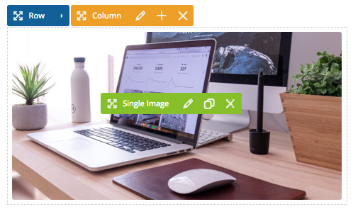
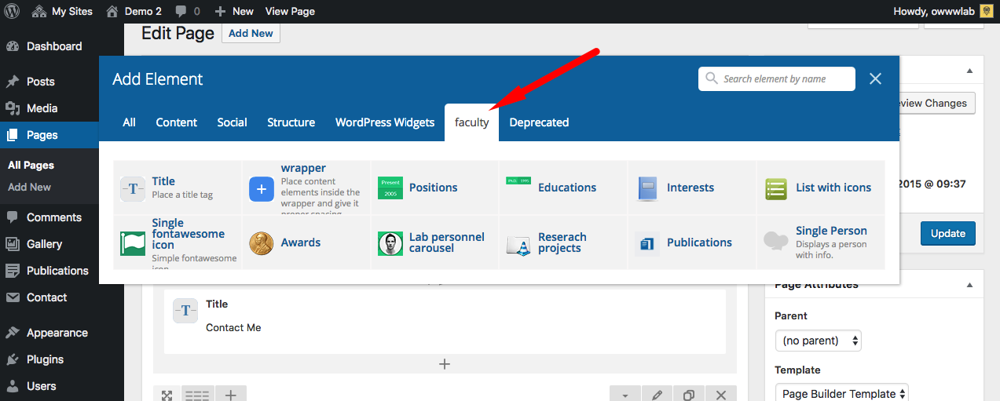
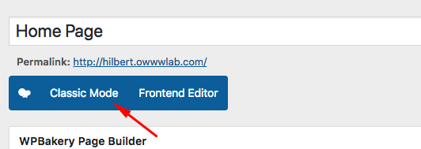

# Pages

## WPBackery Page Builder

Using WPBackery Page Builder plugin you can make more intuitive pages. You can find in depth video tutorials here: [https://wpbakery.com/video-tutorials/](https://wpbakery.com/video-tutorials/)

### What about a license?
WPBackery Page Builder plugin is bundled within the theme. That means you can use it for free but you can not get updates or support directly from the plugin author. So if you saw a "Activate your WPBackery Page Builder" message in future, just dismiss it and use our theme updates for updating the bundled plugins.

### Custom Elements
This theme adds a couple of handful elements to available elements of the page builder. Here is a list of names only for reference:

 

* **Title** : Displays a Heading
* **Wrapper** : Proper spacer
* **Positions** 
* **Educations** 
* **Interest** 
* **List with Icon**
* **Single Fontawesome icon** 
* **Awards** 
* **Lab Personal Carousel**
* **Research Projects**
* **Publications** : Displays a list of your publications
* **Person** : Displays a single person data

## Default Editor
WordPress default editor is also a good option if you need a simple page with text and image only. 

### How to switch between them?
It is pretty simple. You just click the **Classic Mode** button to go to default editor and then on the **Backend Editor** to switch to page builder.

 

