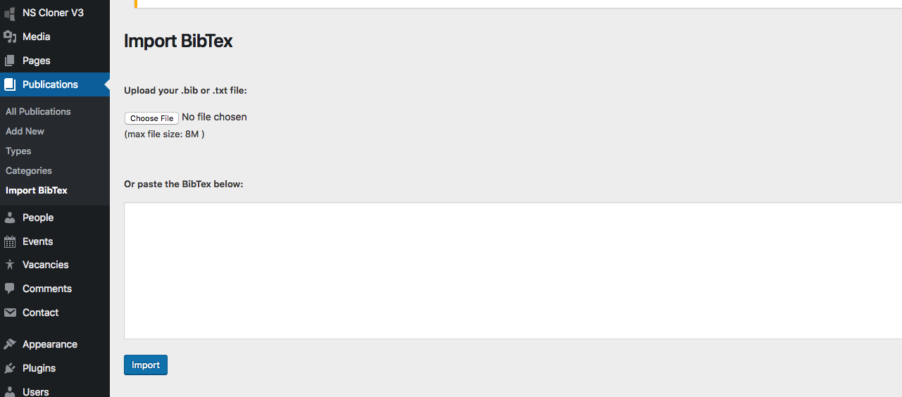

# Publications

## Add a Publication
Adding a publication is simple.
1. Admin Panel > Publications menu > Add new
2. Enter the title of the publication
3. You can build a page for it using the WP Editor or Page Builder.
4. Input the meta-data

## Import Publications
In order to import your publications, you can export a BibTex file from your citation manager software and directly import it. 

> Go to Admin > Publications menus > Import BibTex

There you have tow options.
1. Copy / Paste the BibTex 
2. Upload the file containing BibTex

After the import is finished, you can go to each imported item and complete the meta-data and other information.

 

## Publication Settings
All Publication setting are available at :
> **Admin > Appearance > Customize**  Then **Publications Setting**

## Publication Types
Use this types to organize your publications. Whenever you import with BibTex importer it will add imported document to a publication type.

## Manual Order
In the Publication settings > Post Type Archive, you can order your publications by various measures. In case you want to sort them manually, you can install [Simple Custom Post Order](https://wordpress.org/plugins/simple-custom-post-order/) Plugin. Activate it and go to its settings and check the publications. 

