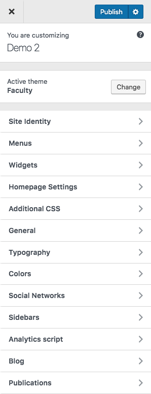

# Theme options

> From v4.0.0 we have moved theme options to WP Customizer Please see [Upgrade Instructions](upgrade) 
 
All options and customizations offered by the theme are available at WordPress Customizer which is placed at <mark>_Dashboard > Appearance > Customize_</mark> menu.

 

It is pretty simple since it shows the changes immediately.

